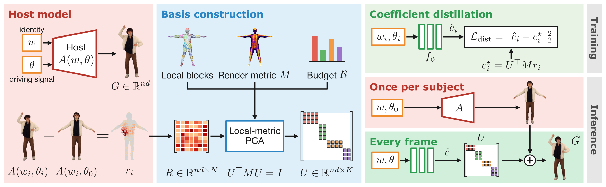

<h1 align="center">
  One Basis to Animate Them All: 
  Gaussian Blendshape Distillation for Real-Time Avatars
</h1>

  <a href="https://ramazan793.github.io/">Ramazan Fazylov</a> &nbsp;·&nbsp;
  <a href="https://scholar.google.com/citations?user=3Bawtm4AAAAJ">Stamatis Lefkimmiatis</a> &nbsp;·&nbsp;
  <a href="https://scholar.google.com/citations?user=-9ifK0cAAAAJ">Ivan Laptev</a>

  
  &nbsp;
  

  <b>TL;DR</b>&nbsp; Gaussian avatars rerun a heavy network for every new pose. GALA distills it into a linear blend
  of shared blendshapes and a shallow MLP: up to ×2,659 faster on CPU, without retraining it.

  

<b>Code coming soon.</b>

